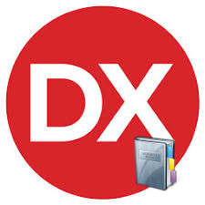

# Delphi-Collection-Projects
- My Own Delphi-Collection-Projects

**Authors:**  *WalWalWalides*
------

## Contains

| File | Contents | 
| --- | --- |
| .gitignore | Git ignores the Files in this File |
|[WinDownly](https://github.com/walwalwalides/Delphi-Collection/tree/master/BatterflyTray)| WinDownly is a Software that deliver a easy method to wirelessly transfer files between your Android device and your Desktop |
|[GAlertService](https://github.com/walwalwalides/Delphi-Collection/tree/master/CheecKfont)| GAlertService is a Software Solution for Creating a Windows Service Monitor Using Email |
| README.md | The Readme for this Project

------

# If You Want To Donate!

